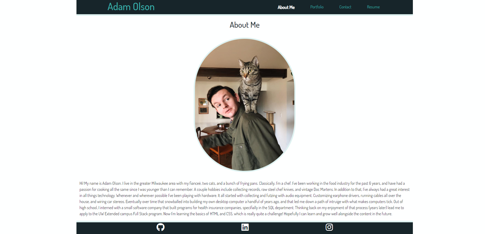
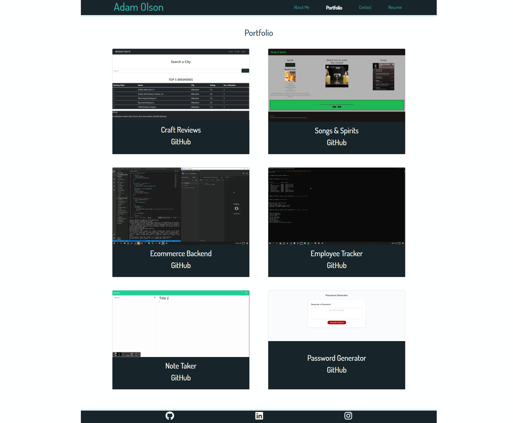

  # React Portfolio

  
  

  ## Description
  
  A new and improved portfolio to showcase skills learned along the way

  ## Table of Contents
  
  * [Installation](#installation)
  * [Usage](#usage)
  * [Contributing](#contributing)
  * [Tests](#tests)
  * [Questions](#questions)
  
  ## Installation
  
  Unimportant, but requires `npx create-react-app` for a very first tiem user starting from scratch. Also an `npm insall` to include all the basic goodies. Has dependency on bootstrap for visuals, and heavy react elements.

  ## Usage
  
  While being a host for six of my favorite projects to date, it is also an example of my progress as a developer within this course. All elements were built from the ground up, using React as the primary vehicle to display and handle information.

  ## Contributing
  
  No contributors at this time

  ## Tests
  
  No collaborators at this time

  ## Questions
  
  Reach out to me at the links below with any questions, comments, or concerns:

  GitHub: [adamlsn](https://github.com/adamlsn) 
  email: [adamlsn@gmail.com](mailto:adamlsn@gmail.com)
  